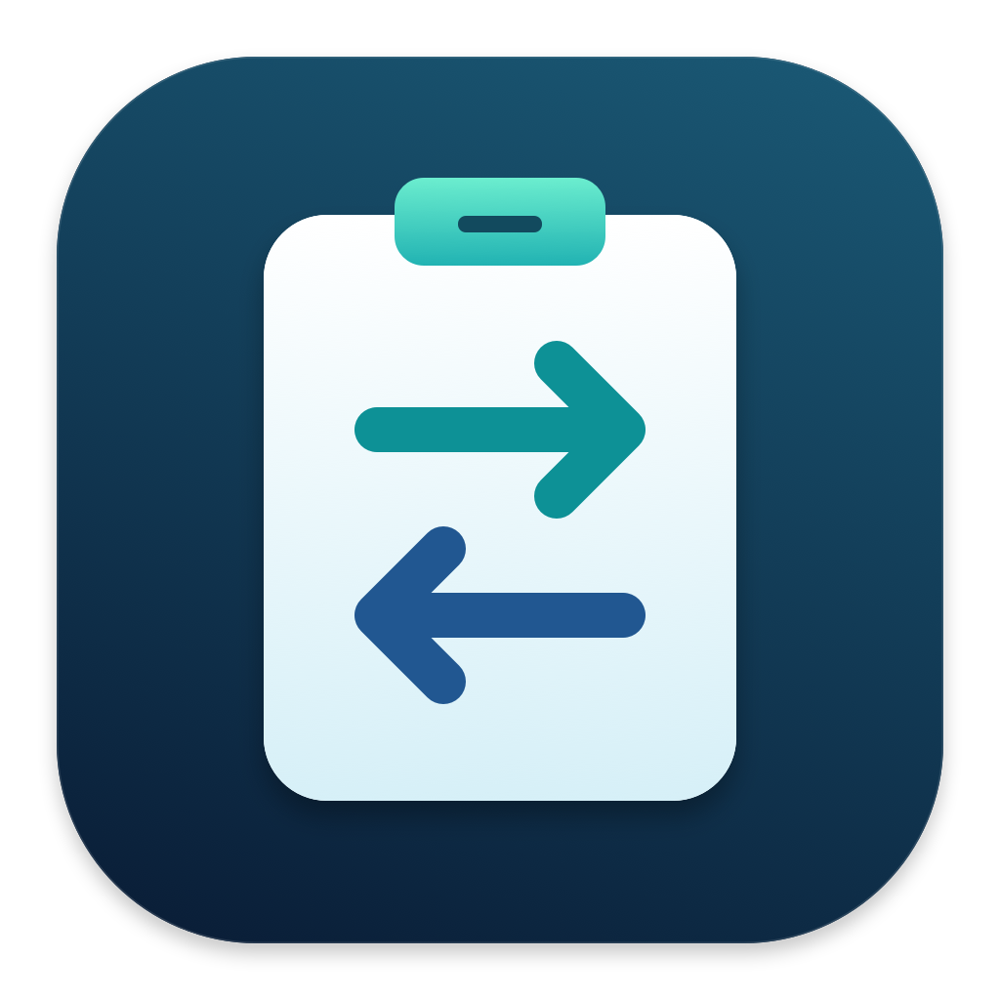
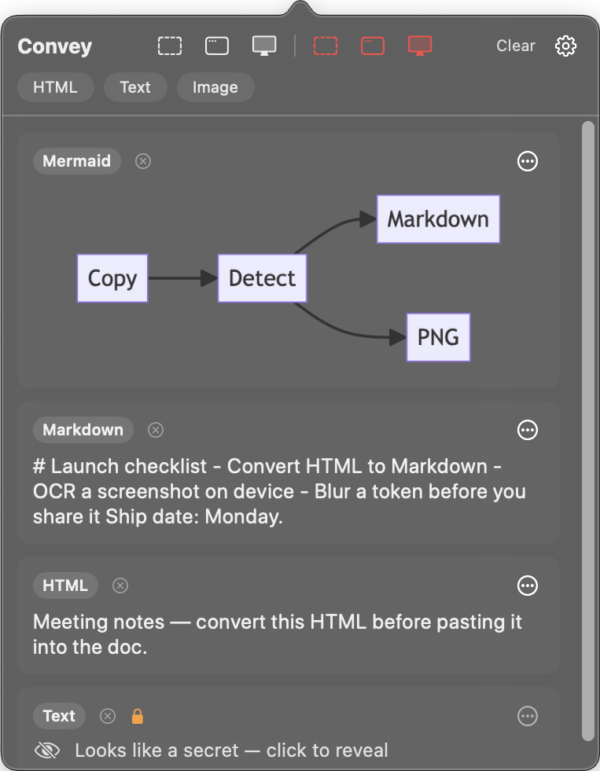
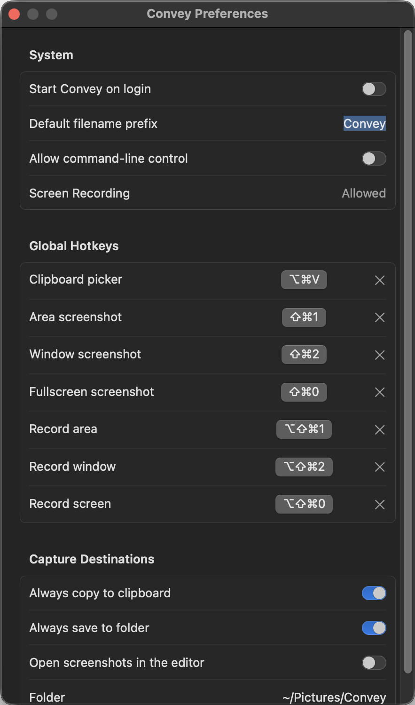
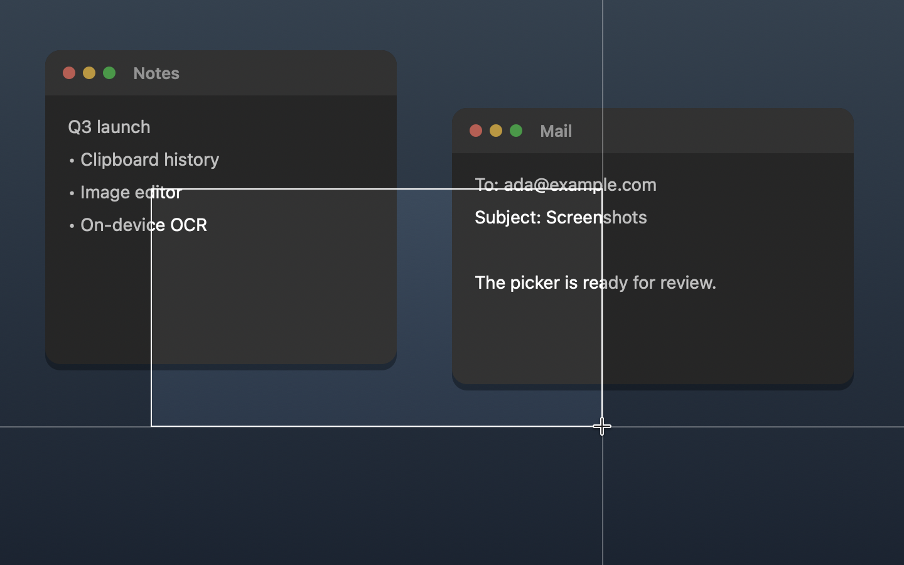
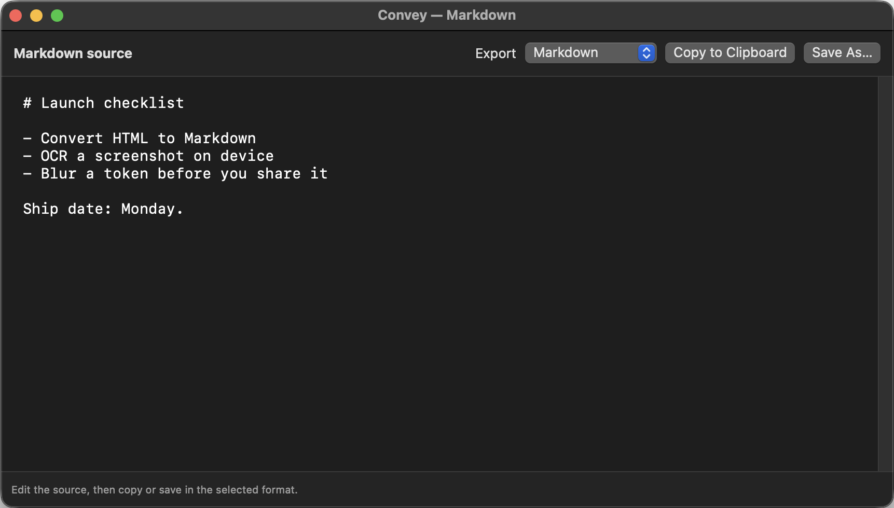
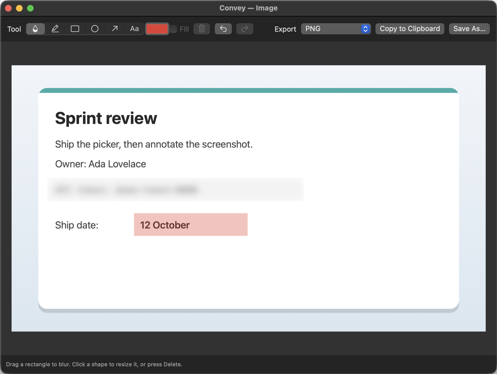

# Convey



Smart clipboard format conversion for macOS — read whatever is on the
clipboard, detect its format, and rewrite it into the format you need.

This repository ships:

- **ConveyCore** — a headless Swift package: flavor detection, a composable
  conversion graph, and converters for HTML↔Markdown, RTF→Markdown,
  image→text (on-device OCR), image→base64 data-URI, and Mermaid→SVG/PNG.
- **convey** — a CLI over the core. It also records terminal sessions as
  asciicast, and drives the running app from scripts and AI agents.
- **Convey.app** — a menu-bar clipboard history, screenshot and screen-recording
  tool, and editor.

## CLI usage

    convey list                     # show detected flavors + valid targets
    convey html2md                  # clipboard HTML -> Markdown -> clipboard
    echo '<b>hi</b>' | convey html2md   # stdin -> stdout
    convey md2html
    convey rtf2md
    convey img2b64
    convey mmd2svg
    echo 'graph TD; A-->B' | convey mmd2png > diagram.png
    convey rec demo.cast            # record this terminal (text + ANSI colors + timing)
    convey play demo.cast           # replay it; idle pauses are capped at 2 s
    convey version                  # print the convey version

`convey rec` wraps a new shell in macOS's built-in `script -r` and converts its
log into [asciicast v2](https://docs.asciinema.org/manual/asciicast/v2/), so the
file works with `asciinema play`, asciinema.org, the web player, and `agg` (GIF).
Exit the shell (Ctrl-D) to stop. `$CONVEY_REC=1` is set inside, so a prompt can
show that it's recording. It can't attach to a terminal window that's already
open, because the app has no access to that window's pty.

### Controlling the app from scripts and agents

Turn on **Preferences › Allow command-line control**, and `convey` can drive the
running Convey.app. The app does the capturing with its own Screen Recording
permission, so the terminal or agent calling it doesn't need that permission.
Every command prints the file path, or an error on stderr with exit code 1.

    convey windows [--json] [--all]               # id, app, title, x,y,w,h (front to back; --all adds other Spaces)
    convey shot window "Google Chrome" -o page.png
    convey shot area 0,0,800,600                  # points, top-left origin, like screencapture -R
    convey record window Terminal --duration 10 -o demo.mp4
    convey record screen 1                        # second display; then:
    convey status && convey stop                  # prints the .mp4 path

A window can be given by its id from `convey windows`, or by part of its app name
or title (the frontmost match wins). The app listens on
`~/Library/Application Support/Convey/control.sock`. The socket file is readable
and writable only by you, and the app also refuses connections from other users.

## Menu-bar app

Run: `make dev-cert` once, then `make run`. `make run` rebuilds the app, quits a
running copy, and opens the fresh bundle, so macOS sees the Convey icon and bundle
identity in permission UI. `dev-cert` creates a self-signed "Convey Development"
signing identity in your login keychain. Without it the bundle is ad-hoc signed,
so its identity changes with every build, and macOS drops the Screen Recording
grant after each rebuild.



A menu-bar clipboard icon opens a visual clipboard list. Each entry shows a type
badge, a preview (text snippet / image thumbnail), and the valid convert
options for that entry — click one to rewrite the clipboard, then ⌘V. Press
⌥⌘V to open the picker from anywhere. History persists across launches;
password-manager entries (concealed/transient) are never captured.
The circled × beside a row's type label removes that entry and persists the change.
The HTML / Text / Image chips under the header filter the list. Select several
to combine them, or none to show everything.

Screenshots (Greenshot-style): ⇧⌘0 full screen, ⇧⌘1 area, ⇧⌘2 then click a window
(Escape cancels). The PNG
is saved to `~/Pictures/Convey/Convey yyyy-MM-dd HH_mm_ss.png` and put on the
clipboard (so it lands in history too). Turn on **Open screenshots in the editor**
to go straight to annotating. The area selector shows the selection size in pixels.

Screen recording: ⌥⇧⌘1 area, ⌥⇧⌘2 window, ⌥⇧⌘0 full screen. The menu-bar
icon turns into a red stop button with a timer; click it or press any recording
hotkey to stop. Area recordings show a dashed red frame that is not in the video.
The MP4 (H.264; HEVC above 4096 px) is saved next to screenshots, revealed in
Finder, and put on the clipboard as a file, so it pastes into Mail, Slack, or
Messages. The picker's header has the same six actions as buttons: capture area, window,
and screen, then record area, window, and screen (in red). Hover a button to see
its hotkey. Right-clicking the menu-bar icon lists them too.

The gear in the picker opens Preferences: rebind hotkeys, filename prefix,
folder, copy/save/editor toggles, start on login (a Login Item), command-line
control, and the Screen Recording status. If permission is missing, Convey
registers itself with macOS and offers **Open System Settings** and **Quit &
Reopen**. macOS then needs you to switch Convey on under *Screen & System Audio
Recording*; no app can switch itself on.



Area capture uses a crosshair cursor with horizontal/vertical guides and a
pixel-size label. Drag in any direction and release to capture; Escape cancels.
Selections stay within the display where the drag started. They are snapped to
whole pixels, so text and 1 px lines are copied 1:1 instead of resampled.



Each history row has a ⋯ menu: convert the clipboard, save as any target
format, or open in the default app. Entries that look like credentials
(`sk-…`, `ghp_…`, AWS keys, private keys, JWTs, `TOKEN=…`) are masked, need
Touch ID / password to reveal, and are never written to disk.

For images, choose **Convert clipboard to → Text** to copy recognized text, or
**Save as… → Text (.txt)** to save it. OCR runs on demand, locally with Apple's
Vision framework; no extra model download or automatic background scanning.
The original image stays in history. Images without readable text report an
error without replacing the clipboard or writing an empty text file.

Click an entry's text or image to open the built-in editor (also available as
**Edit…** in its menu). Text, Markdown, and HTML are edited as source with native
undo/redo. For images, drag to blur, highlight, or draw a square, circle, or arrow;
click to place text. The color well sets the color, and Fill paints a square, circle,
or the background behind text. Click a shape and drag a
corner to resize it, or press Delete. Undo and redo are in the toolbar.
**Copy to Clipboard** and **Save As…**
export the edited result in the selected format, including image OCR to text.
Image annotations are flattened into the exported full-resolution PNG. The
original history entry remains unchanged; closing with unexported edits asks
before discarding them. RTF entries open as plain text for editing.





### Install

```bash
brew install --cask --no-quarantine jverhoeks/tap/convey   # Convey.app + `convey` CLI
```

Or build and install from source: `make install` puts Convey.app in `/Applications`
(`APP_DIR=~/Applications` to change it) and links `convey` into `/usr/local/bin`,
asking for sudo only for that link. `make uninstall` removes both.

For a release build: `make bundle VERSION=0.2.0` produces an ad-hoc signed,
universal `Convey.app` (menu-bar app, CLI, icon, and the ConveyCore resource bundle).
It rebuilds from current sources; `BIN_DIR` is only for explicitly supplied
prebuilt products. `make verify-bundle` checks it; `make archive` creates a ZIP
and SHA-256 checksum under `dist/`. Install the app in `/Applications` before
granting permissions or enabling start on login. Releases are cut with
`make patch|minor|major`; afterwards `make cask` regenerates the cask in the
sibling `homebrew-tap` checkout.

### Known limitations / follow-ups

- Mermaid rows render the diagram as a PNG preview (via `Mermaid → PNG`),
  loaded asynchronously per row; the diagram source text is shown briefly
  until the render completes (first render may take a moment while the
  WebKit-backed engine warms up). Once rendered, the image is memoized in a
  persistent `PreviewCache` keyed by entry id, so scrolling a row off/on
  screen in the picker's `LazyVStack` reuses the cached image instead of
  re-decoding a thumbnail or re-rendering the diagram.

## Build & test

    swift build
    swift test

Requires macOS 13+ and a window server session (WebKit-backed conversions).

## Releases

Pushing a `v*` tag triggers a GitHub Actions workflow that builds a universal
(arm64 + x86_64) release of `convey` and `convey-app`, stamps in the tag's
version (`convey version` / `convey --version` / `convey -v` prints it), and
publishes a `.zip` + `.sha256` checksum to GitHub Releases. Tests must pass before
packaging. Both architectures, bundle resources, icon, version, and signatures
are verified before publication.

Cut a release by bumping the semver tag (computed from the latest `v*` tag)
and pushing it:

    make patch      # v0.1.0 -> v0.1.1
    make minor      # v0.1.0 -> v0.2.0
    make major      # v0.1.0 -> v1.0.0
    make next-version   # preview the next versions without tagging

Or tag manually:

    git tag v1.2.3 && git push origin v1.2.3

Local bundles and the current CI release use ad-hoc signing, not Developer ID
notarization. For public Gatekeeper-compatible distribution, build with
`CODE_SIGN_IDENTITY="Developer ID Application: …"`, notarize with Apple, staple
the ticket, and then create the archive. See [deployment notes](docs/deployment.md).
